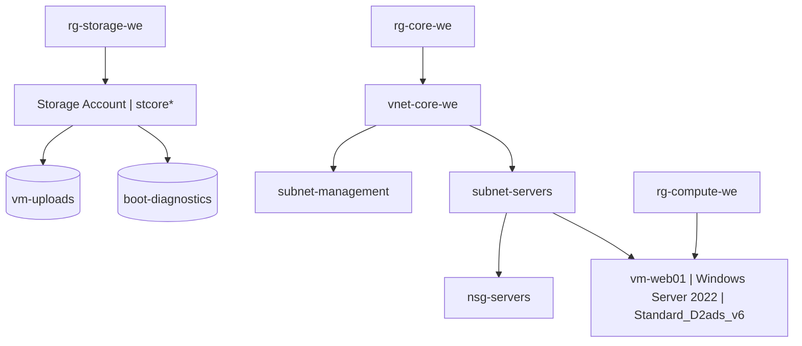

# Azure AZ-104 Project – Shaun Barnett

This repository documents the practical Azure administration tasks I completed while preparing for the **AZ‑104 Microsoft Azure Administrator** exam.  
All resources were deployed inside a real **PAYG subscription** in the **West Europe** region.

The project demonstrates core AZ‑104 skills, including:

- Creating and managing Resource Groups  
- Building secure virtual networks and NSGs  
- Deploying a Windows Server VM  
- Enabling monitoring features (Boot Diagnostics, Insights, Alerts)  
- Implementing governance (Tags, Locks, Azure Policy)  
- Cleaning up resources to avoid charges  

All detailed step-by-step documents are stored inside the **docs/** folder.

---

## 📁 Repository Structure

```
AZ104-Project/
│
├── docs/
│     ├── Step1-ResourceGroup.docx
│     ├── Step2-Networking.docx
│     ├── Step3-NSG.docx
│     ├── Step4-VM.docx
│     ├── Step5-Storage.docx
│     ├── Step6-Monitoring.docx
│     ├── Step7-Governance.docx
│     ├── AZ104-Project-ShaunBarnett.docx
│     └── AZ104-Project-ShaunBarnett.pdf
│
└── (Screenshots stored inside .docx files – no images folder required)
```

---

# 1️⃣ Executive Summary  
This project deploys a full Azure environment following AZ‑104 requirements.  
I created a virtual network, subnets, NSG rules, a storage account, a Windows Server VM, monitoring configuration, governance controls, and final cleanup.

---

# 2️⃣ Architecture Overview

## 🌐 Architecture Diagram (Mermaid)



---

# 3️⃣ Resource Groups

Created three Resource Groups:

- **rg-core-we** – Networking  
- **rg-compute-we** – VM resources  
- **rg-storage-we** – Storage Components  

### CLI

```bash
az group create --name rg-core-we --location westeurope
az group create --name rg-compute-we --location westeurope
az group create --name rg-storage-we --location westeurope
```

---

# 4️⃣ Networking (VNet + Subnets)

- **VNet**: vnet-core-we  
- **Subnets**:
  - subnet-servers (10.0.1.0/24)  
  - subnet-management (10.0.2.0/24)

### CLI

```bash
az network vnet create \
  --resource-group rg-core-we \
  --name vnet-core-we \
  --location westeurope \
  --address-prefix 10.0.0.0/16 \
  --subnet-name subnet-servers \
  --subnet-prefix 10.0.1.0/24

az network vnet subnet create \
  --resource-group rg-core-we \
  --vnet-name vnet-core-we \
  --name subnet-management \
  --address-prefix 10.0.2.0/24
```

---

# 5️⃣ Network Security Group (NSG)

- NSG Name: nsg-servers  
- Inbound Rule: Allow RDP (TCP/3389)

### CLI

```bash
az network nsg create \
  --resource-group rg-core-we \
  --name nsg-servers \
  --location westeurope

az network nsg rule create \
  --resource-group rg-core-we \
  --nsg-name nsg-servers \
  --name Allow-RDP \
  --priority 1000 \
  --protocol Tcp \
  --direction Inbound \
  --source-address-prefixes "*" \
  --source-port-ranges "*" \
  --destination-address-prefixes "*" \
  --destination-port-ranges 3389 \
  --access Allow
```

---

# 6️⃣ Virtual Machine Deployment

- VM Name: vm-web01  
- OS: Windows Server 2022 Datacenter  
- Size: Standard_D2ads_v6  
- Subnet: subnet-servers  

### CLI

```bash
az vm create \
  --resource-group rg-compute-we \
  --name vm-web01 \
  --image MicrosoftWindowsServer:windowsserver:2022-datacenter-azure-edition:latest \
  --size Standard_D2ads_v6 \
  --admin-username azureadmin \
  --admin-password "" \
  --vnet-name vnet-core-we \
  --subnet subnet-servers \
  --public-ip-address "" \
  --location westeurope
```

---

# 7️⃣ Storage Account Deployment

- Storage: stcore*  
- Redundancy: GRS  
- Containers: boot-diagnostics, vm-uploads  

### CLI

```bash
suffix=$RANDOM
az storage account create \
  --name stcore$suffix \
  --resource-group rg-storage-we \
  --location westeurope \
  --sku Standard_GRS

az storage container create --account-name stcore$suffix --name boot-diagnostics
az storage container create --account-name stcore$suffix --name vm-uploads
```

---

# 8️⃣ Monitoring & Alerts

Enabled:

- Boot Diagnostics  
- VM Insights  
- CPU/Network/Disk metrics  
- Alert rule for CPU > 80%  

---

# 9️⃣ Governance (Tags, Locks, Policy)

- Tags added to all RGs  
- Delete locks added and later removed  
- Policy: **Require Owner tag on resource groups**  

---

# 🔟 Validation

- Creation without tag → **DENIED**  
- Creation with tag → **SUCCESS**  

---

# 1️⃣1️⃣ Cleanup

Deleted resources in the correct order:

```bash
az group delete --name rg-compute-we --yes --no-wait
az group delete --name rg-storage-we --yes --no-wait
az group delete --name rg-core-we --yes --no-wait
```

---

# 1️⃣2️⃣ Skills Demonstrated

- Azure Resource Manager  
- VNet/Subnet design  
- NSG rules  
- VM deployment  
- Storage accounts  
- Monitoring & Alerts  
- Governance  
- Cleanup  
- Azure CLI usage  

---

# 📄 Appendix  
Full commands and screenshots are contained inside the `.docx` files in the **docs/** folder.
